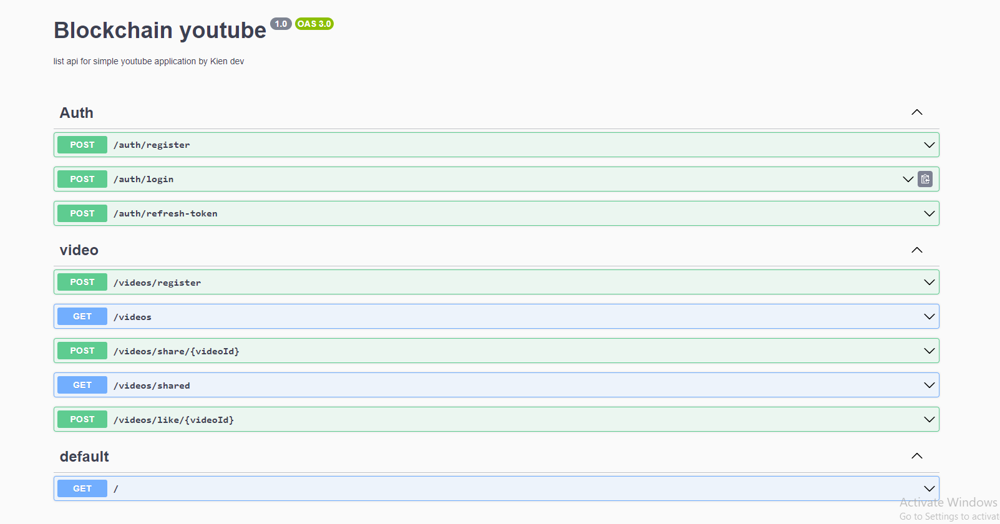

## Author
> Kien_Nguyen

## Description
- role as code backend
- topic: youtube video statistics

## Feature
- Login/Register using jwt to manage user sessions
- You can express your feelings to a video by clicking like, unlike or doing nothing
- realtime notification

## Technologies Used:
- Technologies: typescript, typeOrm, nestjs
- Database: MySql

## Prerequisites and Setup 
- node verion: >=16

## Api image:


## Setup steps for the project

```
$ npm install
```
```
$ cp .env.example  .env and fill in the respective fields
```

## Running the app

```bash
# development
$ npm run start

# watch mode
$ npm run start:dev

# production mode
$ npm run start:prod
```

## Test
```bash
# unit tests
$ npm run test

# e2e tests
$ npm run test:e2e

# test coverage
$ npm run test:cov
```

## Support

Nest is an MIT-licensed open source project. It can grow thanks to the sponsors and support by the amazing backers. If you'd like to join them, please [read more here](https://docs.nestjs.com/support).

## Stay in touch

- Author - [Kamil Myśliwiec](https://kamilmysliwiec.com)
- Website - [https://nestjs.com](https://nestjs.com/)
- Twitter - [@nestframework](https://twitter.com/nestframework)

## License

Nest is [MIT licensed](LICENSE).
